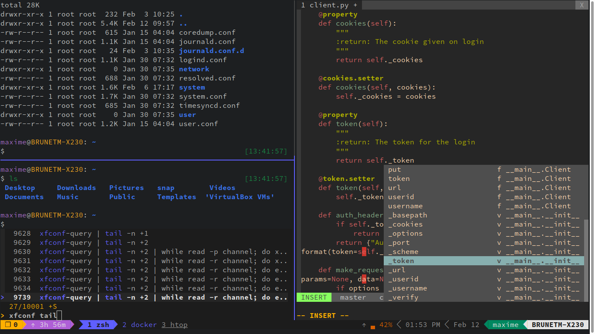

# My Awesome Dotfiles

My dotfiles collection for a flawless workflow. Starring `zsh`, `vim` and `tmux`.



## How to setup

Install as root:
1. python 3
2. pip3
3. pip3 install virtualenv virtualenvwrapper ansible
4. zsh-autosuggestions zsh-syntax-highlighting

Ubuntu notes:
```shell
COLOANE% export VIRTUALENVWRAPPER_PYTHON=/usr/bin/python3.10
COLOANE% source /usr/local/bin/virtualenvwrapper.sh

git clone --depth 1 https://github.com/junegunn/fzf.git ~/.fzf
~/.fzf/install
```


```shell
git clone --recurse-submodules git@github.com:thothh/dotfiles.git ~/.dotfiles
cd ~/.dotfiles
mkvirtualenv .dotfiles
ansible-playbook ansidot/ansidot.yml --inventory localhost, --connection local --extra-vars @apps.yml
```
